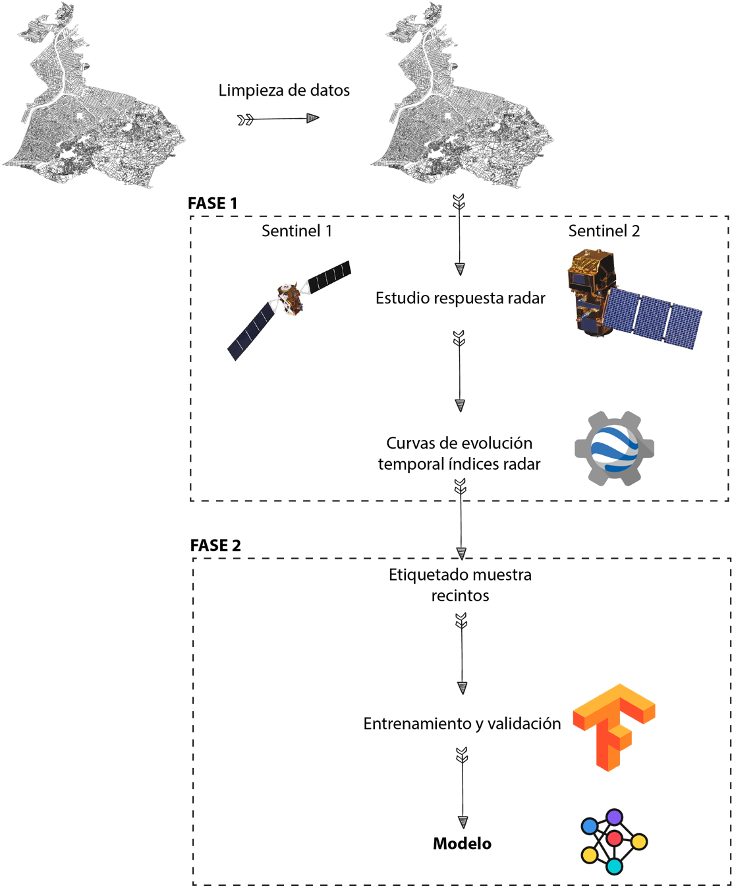

# Monitoring
-------------

Deep learning network for monitoring areas using sentinel-2 for analisys and sentinel-1 for analisys and training.

## Install Earth Engine API and Tensorflow in Windows 10

### 1. Software

* Earth Engine API
* NVIDIA CUDA Toolkit 10.0
* NVIDIA cuDNN v7.6.5
* Python 3.7.6
* Keras 2.3.1
* Tensorflow 1.15.0

### 2. Install CUDA

#### 2.1 Download CUDA Toolkit 10.0 and install it in C hard disk: [CUDA](https://developer.nvidia.com/cuda-10.0-download-archive)

### 3. Install cuDNN

#### 3.1 Download cuDNN v7.6.5 (November 5th, 2019), for CUDA 10.0: [cuDNN](https://developer.nvidia.com/rdp/cudnn-archive)

#### 3.2 Unzip the file downloaded, copy the folders from the zip (include, lib, bin) and replace them with the same folders that are located where CUDA 10.0 were installed.

### 4. Install Python 3.7

#### 4.1 Install Anaconda: [Anaconda]:(https://www.anaconda.com/distribution/)

### 5. Install Earth Engine API, Tensorflow and Keras.

#### 5.1 Open the 'Anaconda prompt'

#### 5.2 Write the following commands:
1. Create the virtual environment: `conda create --name keras-gpu python=3.7.6`
2. Activate the virtual environment: `conda activate keras-gpu`
3. Install earthengine: `pip install earthengine-api`
4. Install keras: `pip install keras`
5. Install tensorflow: `pip install tensorflow-gpu==1.15`
6. Install pandas: `pip install pandas`
7. Install sklearn: `pip install sklearn`
8. Install matplotlib: `pip install matplotlib`
9. Install Linux commands in Windows: `conda install m2-base`
10. Install Python extensions for Microsoft Windows: `conda install pywin32`